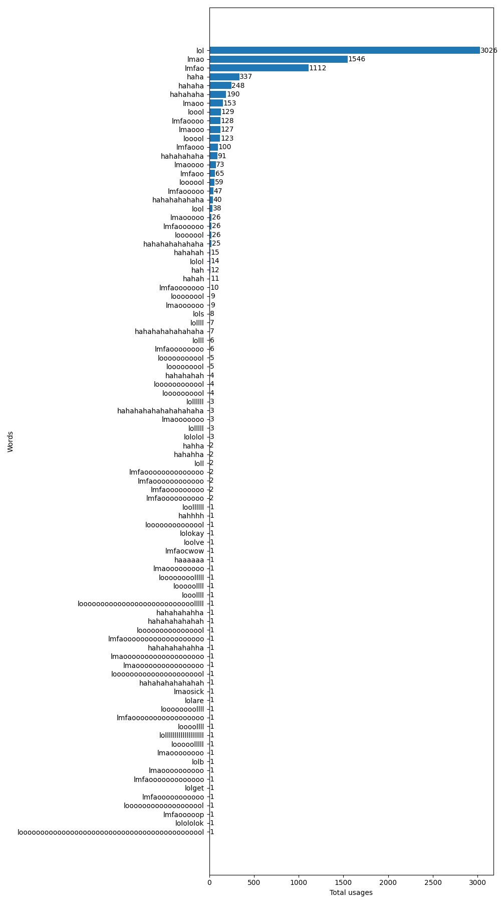
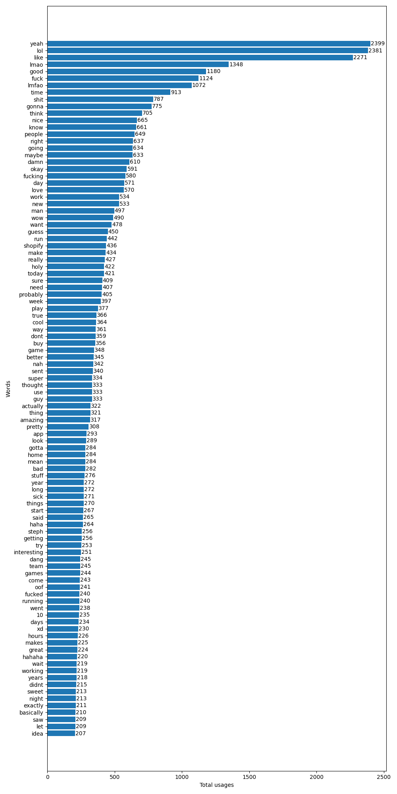
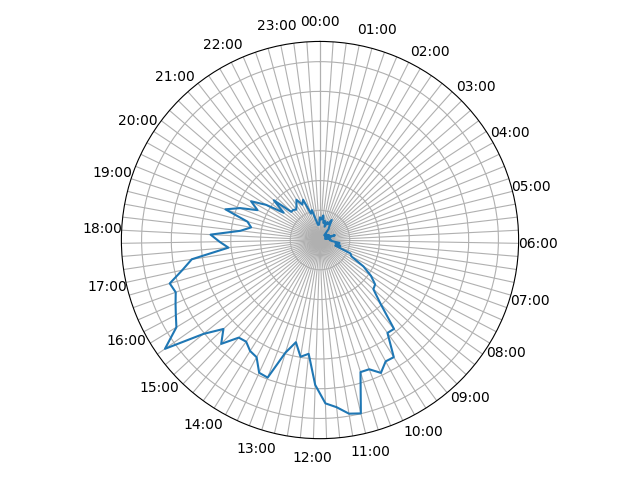
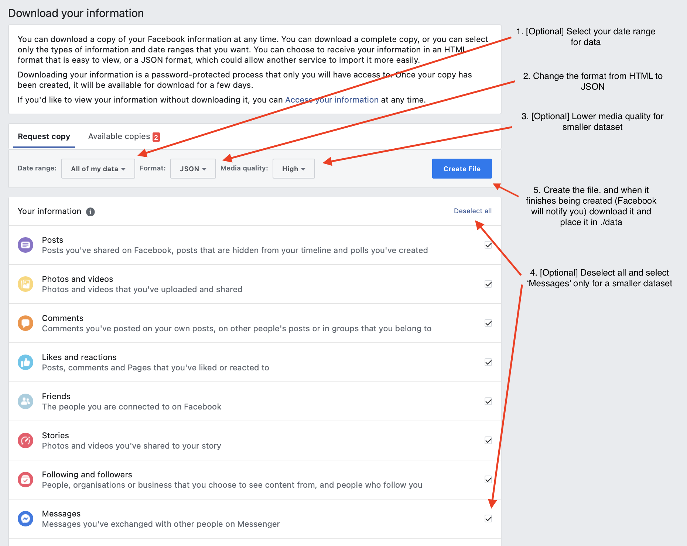

# messenger-analysis

For fun statistics on your Messenger messages

## Examples

### Find how many times you've laughed with friends

`python -m messenger_analysis --plotTopWords 1000 --matchWords "^(lo+l|lmf?ao+|ha[ha]+$)"`

### Find the top words used between you and your best friend

`python -m messenger_analysis --plotTopWords 100 --includeNames "Your Name,Your Best Friend"`

### Plot when you typically send messages throughout the day, in 5/15/30/60 minute intervals

`python -m messenger_analysis --plotTimestamps 15`

## Usage

You'll need to download your Messenger data from Facebook: https://www.facebook.com/dyi

1. Clone the repo
1. `cd messenger_analysis`
1. `pip install -r requirements.txt`
1. Extract your data and move the directory into `./data` or pass the location of the directory with `--datasource`
1. `python -m messenger_analysis -h`
1. See above for examples of invocations.

### Requirements

* Tested with `Python 3.9+`
